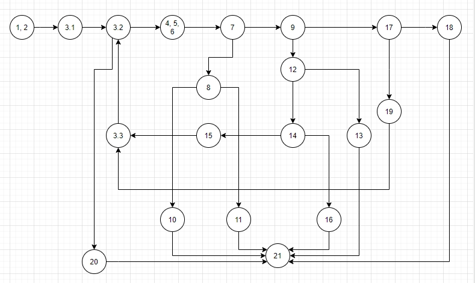

Втора лабораториска вежба по Софтверско инженерство
Анѓела Милосављевиќ 152040

Барање број 2 
Control Flow Graph Diagram

Барање број 3 
Цикломатска комплексност на кодот

Има вкупно 8 региони во CFG дијаграмот па затоа цикломатската комплексност е 8.
Исто така според формулата,имаме 26 ребра - 20 јазли и +2 добиваме повторно 8.

Барање број 4
Тест случаи според Multiple condition критериум

Во нашиот код имаме 4 услови со Multiple condition и тоа: 
 if (hr < 0 || hr > 24) при што имаме 4 исходи преку 3 теста 
 тест со времето(-5,5,5) добиваме точно или (и двете опции со точно или неточно)= точно,при што фаќаме исклучок
 тест со времето(25,5,5) добиваме неточно или точно =точно,при што фаќаме исклучок
 тест со времето(1,1,5) добиваме неточно или неточно каде што имаме добро време 
 
 if (min < 0 || min > 59) при што имаме 4 исходи преку 2 теста 
 тест со времето(1,-5,5) добиваме точно или (и двете опции со точно или неточно)= точно,при што фаќаме исклучок
 тест со времето(1,65,5) добиваме неточно или точно =точно,при што фаќаме исклучок
 опцијата или исходот неточно или неточно каде што имаме добро време,ја имаме опфатено предходно со тестот(1,1,5)
 
 if (sec >= 0 && sec <= 59) при што имаме 4 исходи преку 2 теста 
 тест со времето(1,5,-5) добиваме неточно и (и двете опции со точно или неточно)= неточно,при што фаќаме исклучок
 тест со времето(1,5,65) добиваме точно и неточно = неточно,при што фаќаме исклучок
 опцијата или исходот точно и точно каде што имаме добро време,ја имаме опфатено предходно со тестот(1,1,5)
 
 if (hr == 24 && min == 0 && sec == 0) при што имаме повеќе исходи преку 3 теста 
 тест со времето(24,5,0) добиваме точно и неточно и(и двете опции со точно или неточно)= неточно,при што фаќаме исклучок
 тест со времето(24,0,5) добиваме точно и точно и неточно = неточно,при што фаќаме исклучок
 опцијата или исходот точно и точно и точно каде што имаме добро време,ја имаме опфатено со тестот(24,0,0)
 
 Барање број 5
 Тест случаи според Every branch критериум
 
 Според овој критериум ја ги изменувам сите ребра со истите тестови од предходниот критериум,
 при што водам евиденција со мојот Excel file SI_Lab2_152040_EveryBranch.
 
 Барање број 7
 
 Објаснување на тест методите
 
 Со првиот тест метод emptyListTest(),и преку assertEquals,тестирам случаи кога листата е празна или тоа е null колоната во екселот.
Преку вториот тест метод multipleConditionTesting(),со помош на повик  на функцијата преку помошниот објект,
при што како аргумент користам листа со ново време од тестовите од барања 4 и 5,и користење на try-catch,
правам споредба на пораката од исклучокот и соодветен стринг за даден тест случај.Исто и за ова користам assertEquals.

Третата тест метода everyBranchTesting(),го има истиот код од multipleConditionTesting(),бидејќи се работи за истите тестови за изминување на сите ребра
од дијаграмот.

Дополнително,за тест случајот (1,1,5)или тест случајот(24,0,0)каде што имаме добри времиња кои не фрлаат исклучок,
користам листа од Integer објекти бидејќи морам да споредувам објект Integer со објект Integer кој ми го враќа самата функција function

 